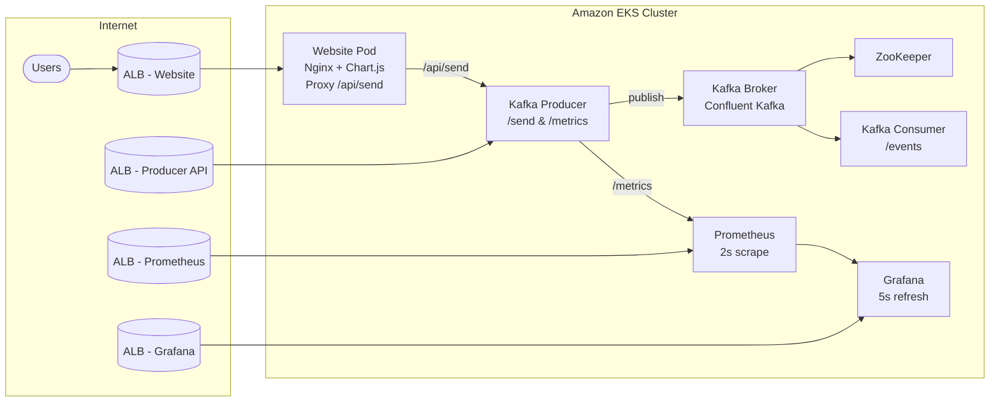

## Event-Driven Observability Stack on AWS

This project delivers a fully-instrumented Event Driven Architecture on Amazon Web Services. A React-free web UI emits synthetic user events, a Java Kafka producer publishes them to an in-cluster broker, a Kafka consumer exposes history, and Prometheus + Grafana provide real-time observability. Terraform builds the AWS foundation, Jenkins (optional) automates container builds and deployments, and everything ultimately runs in Amazon EKS.



> *Pro tip:* open this README in GitHub (or any markdown viewer with Mermaid support) and use your browser zoom (Ctrl/Cmd + Scroll) to inspect individual mappings between services.

### Event Flow (Zoomable Narrative)
1. **User Interaction** – A browser session hits the public website ALB. The static UI (Nginx + Chart.js) renders instantly.
2. **UI Proxy** – Each button fires `fetch("/api/send")`; Nginx forwards this to the internal producer service within the cluster.
3. **Producer Service** – Validates payloads, persists to Kafka (`events` topic), and increments the Prometheus counter exposed at `/metrics`.
4. **Kafka Layer** – Confluent broker + ZooKeeper store the event stream. A consumer pod tails the topic and exposes the last 50 messages on `/events`.
5. **Observability** – Prometheus scrapes the producer (`producer_events_total`) and broker endpoints every 2 seconds; Grafana refreshes its panels every 5 seconds and is accessible via its own ALB.
6. **Feedback Loop** – UI counters update immediately (client-side), Prometheus/Grafana reflect the same traffic within seconds, providing real-time visibility.

### AWS & Tooling
| Layer | Services / Tools |
|-------|------------------|
| Networking | Amazon VPC, public subnets, Internet Gateway, route tables, security groups |
| Compute / Containers | Amazon EKS (control plane + managed node group), Kubernetes Deployments/Services |
| Container Registry | Amazon ECR |
| Load Balancing | AWS Application Load Balancers in front of Website, Producer, Prometheus, Grafana |
| CI/CD | Jenkins (Dockerfile + pipeline), Docker Buildx |
| Infrastructure as Code | Terraform `>= 1.5` + `hashicorp/aws` provider |
| Kafka Stack | Java producer & consumer, Confluent Kafka broker & ZooKeeper |
| Frontend | Static HTML/CSS + Chart.js, proxied through Nginx |
| Observability | Prometheus (2s scrape), Grafana (5s auto-refresh dashboard), custom `producer_events_total` metric |

### Key Components

- `infra/` – Terraform for AWS account bootstrapping (VPC, subnets, security groups, IAM roles, EKS cluster + node group).
- `jenkins/` – Jenkins master image and declarative pipeline (`jenkins_pipeline.groovy`) that:
  1. Logs into ECR
  2. Builds/pushes `website` & `kafka` images
  3. Updates kubeconfig
  4. Applies website, kafka, and monitoring manifests.
- `kafka/`
  - `ProducerApp` exposes `POST /send` and `GET /metrics` (Prometheus counter `producer_events_total`).
  - `ConsumerApp` streams the last 50 events via `GET /events`.
  - `k8s-deployment.yaml` deploys producer/consumer plus external LoadBalancer for the producer API.
  - `k8s-broker.yaml` spins up Confluent Kafka broker + ZooKeeper inside EKS.
- `website/`
  - Static UI served by Nginx, proxies `/api/send` -> `producer-service`.
  - Chart.js renders metrics instantly with every click.
  - Kubernetes deployment uses ECR image and AWS LB.
- `monitoring/`
  - `k8s-config.yaml` configures Prometheus to scrape Kafka broker (`job="kafka"`) and Producer metrics (`job="producer-events"`) every 2 seconds.
  - `grafana-config.yaml` auto-provisions:
    - Datasource pointing to Prometheus service inside the cluster.
    - “Producer Event Metrics” dashboard (5s auto-refresh) showing total events (stat) and live rate (timeseries).
  - `k8s-deployment.yaml` deploys Prometheus + Grafana with external LoadBalancers for easy access.

### Endpoints (current deployment)
| Component | URL | Notes |
|-----------|-----|-------|
| Website UI | `http://a6f7051c2c31741a79470329000fd849-2116788968.us-east-1.elb.amazonaws.com` | Click buttons to emit events |
| Producer API | `http://a97157a7e76e343c7971d665b20ef529-578636936.us-east-1.elb.amazonaws.com:8080/send` | `POST` JSON (GET returns “Producer API is running…”) |
| Producer Metrics | `http://a97157a7e76e343c7971d665b20ef529-578636936.us-east-1.elb.amazonaws.com:8080/metrics` | Exposes `producer_events_total` counter |
| Prometheus | `http://ae92d9c6857784853800e18375a1ea4e-935777073.us-east-1.elb.amazonaws.com:9090` | Run `producer_events_total` or `rate(producer_events_total[1m])` |
| Grafana | `http://a18dab1aa3d9a4148b281e7ecb811213-1022019633.us-east-1.elb.amazonaws.com:3000/login` | Creds `admin / admin` → “Producer Event Metrics” dashboard |

### Workflow Overview
1. **Infrastructure** – `cd infra && terraform init && terraform apply -var 'region=us-east-1'`.
2. **Container builds** – Either run the Jenkins pipeline or build manually:
   ```bash
   docker build -t ${ACCOUNT}.dkr.ecr.${AWS_REGION}.amazonaws.com/website:latest ./website
   docker build -t ${ACCOUNT}.dkr.ecr.${AWS_REGION}.amazonaws.com/kafka:latest ./kafka
   docker push ...
   ```
3. **Deploy to EKS** – Update kubeconfig (`aws eks update-kubeconfig --name event-driven-eks --region us-east-1`) and apply manifests:
   ```bash
   kubectl apply -f kafka/k8s-broker.yaml
   kubectl apply -f kafka/k8s-deployment.yaml
   kubectl apply -f website/k8s-deployment.yaml
   kubectl apply -f monitoring/k8s-config.yaml
   kubectl apply -f monitoring/grafana-config.yaml
   kubectl apply -f monitoring/k8s-deployment.yaml
   ```
4. **Verify**
   - Website responds with latest UI (`Ctrl+Shift+R` to bypass cache).
   - `kubectl logs deployment/kafka-producer` shows `📤 Event sent`.
   - `kubectl logs deployment/kafka-consumer` shows `📥 Received`.
   - Prometheus query `producer_events_total`.
   - Grafana dashboard updates within ~5s of each click.

### Observability Recipes
- **Prometheus**
  ```promql
  producer_events_total
  rate(producer_events_total[1m])
  up{job="producer-events"}
  ```
- **Grafana**
  - Dashboard: *Producer Event Metrics* (auto-provisioned).
  - Panels refresh every 5 seconds.
  - Add more panels by editing `monitoring/grafana-config.yaml` and re-applying.

### Running Locally (Optional)
1. Start Kafka + ZooKeeper + Prometheus + Grafana via docker-compose:
   ```bash
   docker compose -f kafka/docker-compose.yml up -d
   docker compose -f monitoring/docker-compose.yml up -d
   ```
2. Run producer/consumer locally (`mvn package && java -cp ... ProducerApp`).
3. `docker build -t website-ui ./website && docker run -p 3000:80 website-ui`.
4. Point `website/app.js` `PRODUCER_API` at your local producer endpoint.

### Troubleshooting
- **UI not updating:** Hard refresh, ensure `app.js` loads (`Network` tab). Browser extensions sometimes block `/api/send`.
- **Port-forward unauthorized:** run `aws eks update-kubeconfig --name event-driven-eks --region us-east-1` before `kubectl port-forward`.
- **Grafana empty:** Ensure you’re logged in (admin/admin) and on “Producer Event Metrics”; Prometheus must show non-zero `producer_events_total`.
- **Need HTTPS / custom domains:** front the ALBs with Route53 + ACM certificates.

This README now serves as the single source of truth for everything in the stack—architecture, AWS touch points, runtime URLs, metrics, and the steps required to maintain or extend the system. Have fun instrumenting! 
